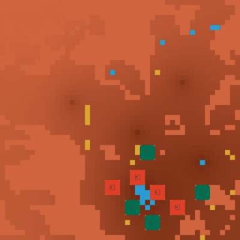
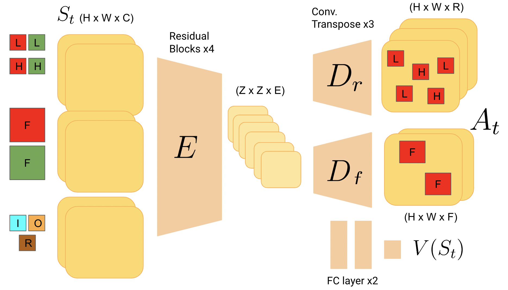

# Centralized control for multi-agent RL in a complex Real-Time-Strategy game

This repository contains the source code for the project "Centralized control for multi-agent RL in a complex Real-Time-Strategy game", which was submitted as the final project in the [COMP579 - Reinforcement Learning course at McGill](https://www.cs.mcgill.ca/~dprecup/courses/Winter2023/syllabus.html) given by Prof. Doina Precup in Winter 2023.

&rarr; The main scripts for understanding the code are **fully commented**. We present the PDF report and the code in the following sections.

&rarr; The full report of the project is available [here](www.google.com).

&rarr; The Weights & Biases logs of our experiments are available [here](www.google.com) (hyperparameter sweep) and [here](www.google.com) (best configuration).


|  PPO in Lux | during training |  
|:-------------------------:|:-------------------------:|
|| | 


### Running the code

&rarr; There are 2 main scripts of ~1000 and ~900 lines of code which are ```src/envs_folder/custom_env.py``` and ```src/ppo_res_gridnet_multigpu.py```.

&rarr; The repository contains many variations of *gridnet* scripts but the simplest one and **fully commented** is ```src/ppo_res_gridnet_multigpu.py```.

To train our **gridnet** in Lux:

1) Clone this repository

2) Install the requirements

3) Train Gridnet (example uses 1 GPU and 1 process)

```
cd src
torchrun --standalone --nproc_per_node 1 ppo_res_gridnet_multigpu.py --device-ids 0
```


The best agent was trained using the best parameters discovered in the [hyperparameter sweep](www.google.com) and 16 processes on 8 GPUs, running:

```
torchrun --standalone --nproc_per_node 16 ppo_pixel_gridnet_multigpu.py 
--total-timesteps 1000000000 
--clip-coef=0.14334778465053272 
--ent-coef=0.002408486638907176 
--gae-lambda=0.9322312137190516
--gamma=0.9945973988514306
--learning-rate=0.0016166261475302418 
--max-grad-norm=0.28978755223510055 
--minibatch-size=128
--num-envs=256 
--num-steps=64 
--pool-size=5 
--save-every=50 
--update-epochs=7 
--vf-coef=0.2734614814048212 
--device-ids 0 0 1 1 2 2 3 3 4 4 5 5 6 6 7 7

```


### Description

In this project we implement an RL agent to compete in the [Lux AI v-2 Kaggle Competition](https://github.com/Lux-AI-Challenge/Lux-Design-S2). Lux is a 1vs1 real-time-strategy game in which players must compete for resources and grow lichen in Mars. Lux is a multi-agent environment because players control variable-sized fleets of units of different natures (e.g. light and heavy robots, and factories). The full specifications of the lux environment are available [here](https://www.lux-ai.org/specs-s2).

### Our approach

We propose a pixel-to-pixel architecture that we train with Proximal Policy Optimization (PPO). The encoder is a stack of Residual Blocks with Squeeze-and-Excitation layers and ReLU activations and the decoders are both a stack of Transposed Convolutions and ReLU actiovations. The critic uses and AveragePool layer and 2 fully connected layers with a ReLU activation.

<div align="center">
  
</div>


### Citation

If you use this code, please cite it as below

```
@misc{creus2023centralized,
author = {Creus Castanyer, Roger},
month = {4},
title = {Centralized Control for Multi-Agent RL in a complex Real-Time-Strategy game},
url = {https://github.com/roger-creus/lux-ai-rl},
year = {2023}
}
```


